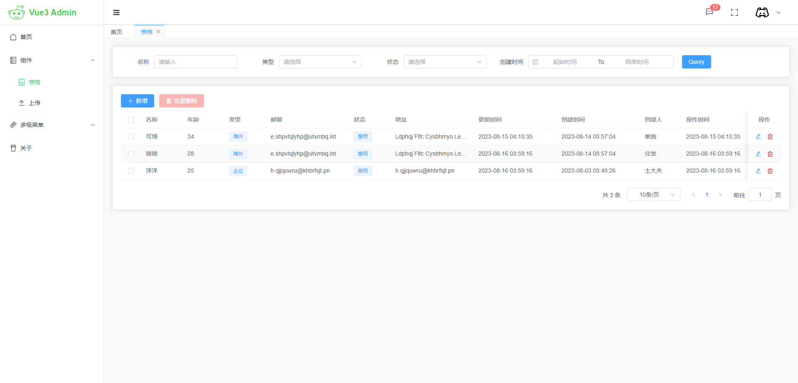

  <h1>VUE3 Admin + Koa2</h1>
  

### 功能

登录,动态菜单,标签页,换肤等基础功能,此外还有一个基础增删改查批量删除的表格模板

## 前端

一个管理端模板，前端基于 Vue3、TypeScript、Element Plus、Pinia 和 Vite 等主流技术

## 后端

基于 koa2、关系数据库（暂时只支持 mysql）建立的智能微服务快速开发框架，同时支持 graphql 与 rest 标准，使用 typescript 语言编写，力求安全、高效。 更多文档在[这里](https://github.com/zhoutk/gels)

## 安装运行

- **[服务端](./server/README.md)**

- **[前端](./web/README.md)**

## 特性

- **Vue3**：采用 Vue3 + script setup 最新的 Vue3 组合式 API
- **Element Plus**：Element UI 的 Vue3 版本
- **Pinia**
- **Vite**
- **Vue Router**
- **TypeScript**
- **PNPM**
- **Less**
- **CSS 变量**
- **ESlint**
- **Prettier**
- **Axios**

## Vite 插件

- **[unplugin-auto-import](https://github.com/antfu/unplugin-auto-import)**：自动导入第三方库或组件。根据代码中使用的标识符自动检测并导入相应的库或组件

- **[unplugin-vue-components](https://github.com/antfu/unplugin-vue-components)**:自动注册 Vue 组件。根据代码中使用的组件标签自动注册相应的组件

- **[unplugin-vue-router](https://github.com/posva/unplugin-vue-router)**:自动生成路由。根据文件目录生成相应路由

- **[vite-plugin-vue-layouts](https://github.com/posva/unplugin-vue-router)**:通过代码中的 route 指定其 layout,默认为 default
